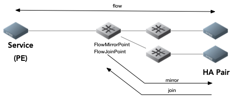
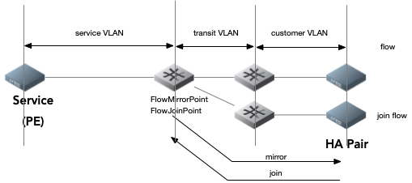

# High Availability Flow 

## Idea
To connect traditional High Availabilty (HA) devices to a Kilda network we must provide a facility in Kilda to mimic a multi-access Ethernet.  We have been able to demonstrate in our testing that a flow-mirror 
combined with a flow-join can mimic such a capability. 

## Background
Kilda already has the ability to mirror flows at any point in the path of the flow, thus half of the work to create a multi-access capability is already done.  We'll discuss a couple of different scenarios in which we'd use this mirror capability: the first is the ability to mirror an individual customer flow.  

In this case we'd be mirroring the data coming from a single instance of a service.  For instance, if a customer wished to mirror the data coming from an Internet connection or from an MPLS connection.  We would offer such a service to customers running Virtual Machines (VM) within a Kilda network.  Second, we'll stay with the individual customer flow that originates in a service and terminates into a VM, but we'll use a Y-flow instead of a simple flow.  The Y-flow would have a branching (A and B)  end at the service side (e.g. Internet or MPLS side) and as the primary and secondary parts of the Y-flow near the HA devices we'll want to mirror both primary and secondary and make primary and secondary appear to terminate in both HA devices.  

Finally, we'll discuss the notion of a dedicated service link as the origin of the flow.  In this last case we'll dedicate an entire service entity, for instance an entire instance of an Internet link or an entire interface into the MPLS network.  Here, because we can control both ends of the connection and because we can ensure that the originating and terminating VLAN-IDs are the same, we can mirror an entire trunk-based flow and make all of the component VLAN-IDs appear at both ends of the link.  We could also use a Y-flow as a trunk in this case although using a Y-flow for HA would require two mirrors and two joins.

## Joins

Mirroring of a flow will enable us to make packets from a source appear at both destinations but it does nothing to make certain that packets from both destinations can reach the source.  In other words, while Kilda builds flows that are bidirectional, mirrors are not bidirectional. 
 
*Note that one way to accomplish the HA requirment described herein would be to add an option in the API to make the mirroring of a flow a bidirectional event.

Treatment of the Join portion of an HA flow depends upon how that flow is constructed.  The most complicated case for joining traffic into a flow and making both the primary and secondary HA devices appear to be connected to the same flow corresponds to the simplest use case for an HA flow:  the individual customer.

In the figure directly above we can see that the flow can be decomposed into three separate segments, each with a different VLAN-ID as an identifier.  From left to right we see that the Service is going to tag packets that originate at this end of the flow with a "Service-based" VLAN-ID.  Next, that VLAN-ID is removed by OpenKilda and replaced by a transit VLAN-ID or a transit VX-LAN header.  The packets continue through the Kilda network with this VLAN/VXLAN-ID until they reach the FlowMirrorPoint in the path.  At the FlowMirrorPoint the transit VLAN/VXLAN-ID is removed and a customer-specific VLAN-ID is pushed onto the packet for delivery to the customer's application.

In the case where the traffic is to be mirrored, the customer-specific VLAN-IDs are pushed onto both the original flow and the mirrored flow.  In this way the two HA devices will always receive identical traffic from the flow and mirrored flow (as they would in a multi-access Ethernet network).  Next we need to get the return traffic back to the Service endpoint.

Having a FlowMirrorPoint is useful in this case as we can use the same FlowMirrorPoint to join traffic to our flow as we use to mirror traffic to each of the original flow and mirrored flow.  In the simple service case, as traffic comes into the FlowJoinPoint, that traffic must be stripped of the customer-specific VLAN-ID and the traffic inserted into the transit VLAN/VXLAN-ID traffic.  From here the return traffic from the secondary HA device is indistinguishable from the original flow traffic from the HA primary device and will proceed to the Service element in a normal fashion.   

Because the FlowJoinPoint may be some number of switch-hops from the secondary HA device we may consider implementing the join activity in two parts.  The first part would be to create a flow that originates at the secondary HA device and uses the same VLAN-ID as used by the primary.  This original flow would then terminate on the FlowMirrorPoint = FlowJoinPoint.  The second part of the operation would make sure that the customer-specific VLAN-ID was removed from the traffic and to ensure that the traffic exits that switch on the same egress port and transit VLAN/VXLAN-ID

##Similarities to MirrorFlow
In the design of the flow mirroring we established a set of FlowMirrorPoints to be carried in the flow attributes.  In addition to the list of FlowMirrorPoints, which will contain MirrorGroupId for multicasting on the switch, the HA feature will require a set of FlowJoinPoints (which may in all cases be the same set) that will switch traffic coming in from the secondary HA device such that this traffic "joins" the mirrorred flow.

Just as a FlowMirrorPoint might mirror the traffic of an entire trunk flow or the traffic of an access flow, the HA feature must also allow traffic to be inserted into a trunk or an access (VLAN-based) flow.  FlowJoinPoint itself has a list of JoinFlowPaths (perhaps separate flowID's). Each item in the list of JoinFlowPaths contains the endpoint from which the traffic should be joined and other necessary information to build the path.

If the join point is on the mirroring source switch, then no segments will be built for such a MirrorFlowPath, 
and we will work with it like the paths in one switch flow.

##Model
The data model for this feature depends on the implementation choices.  A "FlowJoinPoint" may simply become an attribute of FlowMirrorPoints and the FlowJoinPath might be an additional and separate list attribute owned by FlowMirrorPoints.  To be even more simple, the notion of a Join may just be an attribute of a mirror such that no additional list is required.  A FlowMirrorPath already has all of the attributes required to create a Join in the reverse direction to the mirrored flow except a flowID that would be joined from the HA destination to the original flow at the MirrorPoint.

At this point we do not anticipate the need for more than one FlowJoinPoint per FlowMirrorPoint (although that idea may lead to our ability to replace the SEN network controller...)

## API
* Create join point:

	`PUT /flows/{flow_id}/join`

Option 1 payload:
 
	 {	
		"join_point_id": string,	
		"flow_id_to_join": string,
		"flow_id_from": string,
		"join_point_switch_id": string.
	  }
	
Option 2 payload:
 
	 {
	   "join_point_id": string,
		"flow_id_to_join": string,
		"join_point_switch_id": string
		"source_endpoint": {
			 "switch_id": string,
			 "port_number": int,
			 "vlan_id": int,
			 "inner_vlan_id": int
			}
	 }

* Delete mirror point:

  `DELETE /flows/{flow_id}/join/{join_point_id}`

* Get list of mirror points by flow id:

  `GET /flows/{flow_id}/join`

Option 1 response payload:
 
 	  {
        "flow_id": string,
        "points":[
          {
            "join_point_id": string,
            "join_point_switch_id": string,
            "sink_endpoint": {
                "switch_id": string,
                "port_number": int,
                "vlan_id": int,
                "inner_vlan_id": int
            }
          }
        ]
      }
  
Option 2 Response payload:

	  {
        "flow_id": string,
        "points":[
          {
            "join_point_id": string,
            "flow_id_to_join": string,
            "flow_id_from": string,
            "join_point_switch_id": string
          }
        ]
      }

  `join_point_id` must be specified by user. It's unique across the flow and can only consist of alphanumeric 
  characters, underscore, and hyphen. The length of this parameter must not exceed 100 characters.

* API that needs to be updated: 
  - Need to decide on which of the options to use, create a second flow and join it or create the join as one atomic operation.
  - It is necessary to add information about built joins and join paths to API `GET /flows/{flow_id}/path`

## Workflow

Depends on implementation choices

## Affected kilda components
* need to add joins attribute mirror groups to the Floodlight;
* need to update RerouteTopology to react to the network events for the joins and join paths;
* add logic to the flow update operation when updating flow endpoints;
* update switch and flow validation.

## Limitations
Join points should be coincedent with mirror points (in every case?).  It's imperitive that an HA flow have MirrorPoints and JoinPoints that can be rebuilt in the case of failure.  It's also imperitive that the egress switch for the original flow, the MirrorPoint switch, and the egress switch for the secondary flow not be the same.  In other words, one Openflow switch failure cannot affect the operation of the HA capability.   

In the case where a Service link is dedicated and the HA capability is created by using trunk flows (Y-flow or simple flow) the downstream applicaton will require that the Service VLAN-ID be the same value as the Customer VLAN-ID.

## Related issues
There are currently no asymmetric bandwidth ISLs in the system. This feature sets paths in one direction only but the paths that are created should match the asymmetric paths that were originally created by the mirror operation.

## Switch rules
Existing actions set for any type of existing OF flows (ingress, transit, egress) 
will be replaced with a "goto group" action instead of an "output port" action.
The group will have 2 or more buckets: one will represent output to the flow or ISL port, 
the rest will represent join actions set (i.e. routing from the join paths).

## FSM diagrams

### FlowMirrorPointCreateFsm

### FlowMirrorPointDeleteFsm
Footer
© 2022 GitHub, Inc.
Footer navigation
Terms
Privacy
Security
Status
Docs
Contact GitHub
Pricing
API
Training
Blog
About
