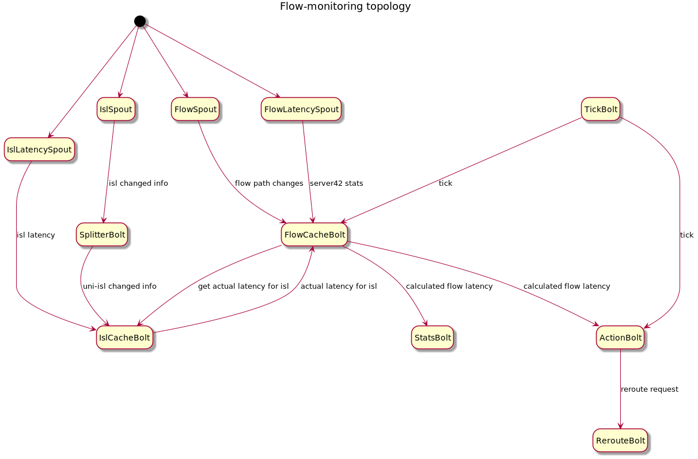
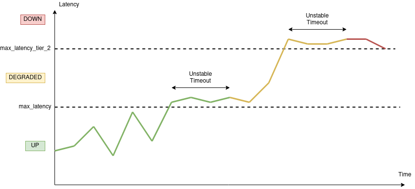
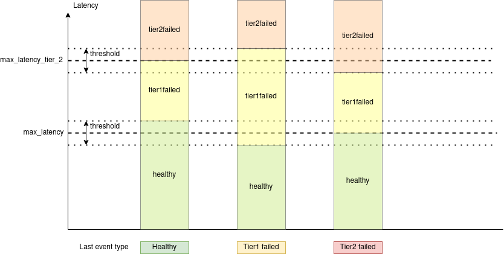
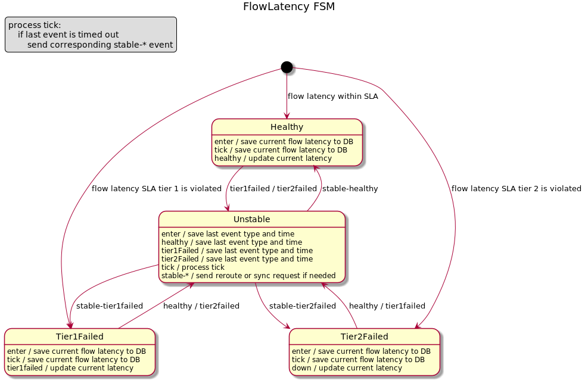

# Flow SLA monitoring and reactions

Open-kilda should detect flows with violated latency SLA in real-time. The new topology `flow-monitor` is designed for this purpose. 

## Flow SLA monitoring
The main idea is to keep an in-memory cache of all flows with actual latencies and a cache of ISLs with actual latencies. 

Flow cache structure:

Flow id | Server42 latency | Flow path
--- | --- | ---

All flows should pass SLA checks periodically. If the flow has not expired Server42 latency measurement then we can do a simple check. In another case, we should calculate actual flow latency based on used ISLs latencies with priority to RTT latency. When we need to calculate ISL latencies FlowCacheBolt creates a request with new correlation-id and send requests with the id to IslCacheBolt for each required ISL. FlowCacheBolt sum up latencies from responses and wait until receive required number (number of ISLs in flow path) of responses with the id. FlowCacheBolt send calculated latency to ActionBolt when receive last required response.

ISL cache structure:

ISL | last RTT latency | RTT latency expiration time | last one way latency
--- | --- | --- | ---

On the topology startup both caches initialized with data from the database. During the topology lifetime system events helps to keep caches in actual states. `flow-hs` will notify `flow-monitor` about any flow path changes using additional events. All flow-modifying FSMs will execute `NOTIFY_FLOW_MONITOR` action before the finish. `network` topology will notify `flow-monitor` about ISL changes.

## Flow SLA reactions

Every calculated flow latency value will be sent to stats topology and saved in openTSDB.

Flow SLA reactions are applied only to flows with latency-based path computation strategies. Flow has two levels of latency SLA called max_latency and max_latency_tier_2. When actual flow latency is lower than max_latency flow is considered as UP, when latency is in between max_latency and max_latency_tier_2 flow is considered as DEGRADED, in other case flow is considered as DOWN. Timeout is used to prevent flow status flapping when latency is fluctuating around one of the SLA levels. Flow latency should exceed SLA level and stay stable for a timeout time window before system will change actual flow status. 

Flows with zero or null max_latency value are excluded from the monitoring. Flows with a valid max_latency value but with null or zero max_latency_tier_2 act like max_latency_tier_2 is infinity. So they may go to the DEGRADED status but can't go to the DOWN status based on the latency.

Auto reroute is triggered by the system when flow changes status to DEGRADED or DOWN only when flow has latency-based path computation strategy. DEGRADED status for flow may be caused by different reasons so when flow is moved from DEGRADED state to UP flow sync is required to determine actual flow status. Flow latency FSM doesn't change flow status directly. Only flow reroute or sync triggered by monitoring should manipulate with flow statuses.

Current flow latency will be stored in DB and updated every time flow latency changes its status or periodically.

Finite state machine with the following structure will be used to cover logic described above.
Every flow latency measurement produces one of the following events: `healthy`, `tier1failed` and `tier2failed`. Latency value, `maxLatency`, `maxLatencyTier2`, threshold value and last event type is used to determine what event is produced as shown on the following picture.

When flow latency FSM detects stable state it produces corresponding `stable-healthy`, `stable-tier1failed` or `stable-tier2failed` event and sends required reroute/sync request.

