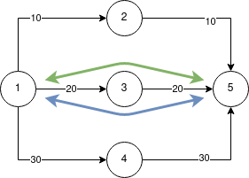
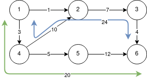

# Max latency strategy issue

## Overview
In the `MAX_LATENCY` strategy algorithm, we should find a path whose weight is less than a certain value, 
but as close as possible to it. To solve it, we use the algorithm described [here](../design.md). 

## Issue
The described problem is NP-complete. And this algorithm does not always work, since there is no algorithm that solves 
this problem in polynomial time. In some network configurations, it cannot find the required path. 
In the following example, the algorithm will not work, although there is a solution: 
find a path from vertex `1` to vertex `4` with the `max_latency = 5`.

In case of a network configuration change (for example, the ISL has entered the DOWN state or 
the ISL is under maintenance), a situation may arise where the `MAX_LATENCY` strategy algorithm cannot build a path.

## Proposal
Change current algorithm from greedy to non-greedy. In some cases it may lead to paths with latency not so close to the limit, but it will always find a path if it exists. Difference between two algorithms are shown on examples:

In simple cases 1 and 2 both algorithms finds the best path.

Max-latency: 25

Max-latency: 45

Case 3 shows current issue: changed algorithm finds path but current one fails.

Max-latency: 11

Case 4 shows that changed algorithm not able to find path closest to max-latency param.

Max-latency: 25
