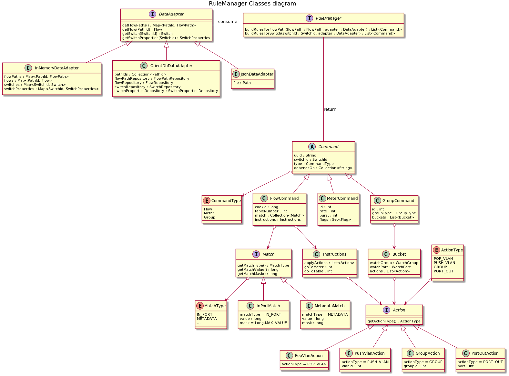

# Implementation details for RuleManager library

Facade of RuleManager lib is implemented as an interface with two methods:
1. buildRulesForPaths(SwitchId switchId, DataAdapter adapter)
2. buildRulesForSwitch(PathId flowPathId, DataAdapter adapter)

Different adapter implementations may query database or read a file under the hood. Each operation should use separate adapter because they may cache data for better performance. All required parameters are provided as constructor params and filled by the calling component.

To generate service rules generators hierarchy (similar to current SwitchManager implementation) is used but the logic is moved from floodlight to RuleManager lib and result is in custom Command format. To generate flow related rules similar way is introduced. Custom Command format is close to OpenFlow format to simplify translation in speaker.

From floodlight perspective 3 new SpeakerCommands added: InstallCommand, VerifyCommand and RemoveCommand. Each command contains only one Command. Commands should be sent to speaker one by one or using a batch grouped by target switch. Floodlight should translate custom Commands into loxigen OpenFlow representation, send it to devices and process results. RuleManager returns collection of Commands with dependencies and the calling component (Flow-HS or SwitchManager) is responsible for encapsulating and sending this commands into floodlight in right order and correct batch options.
